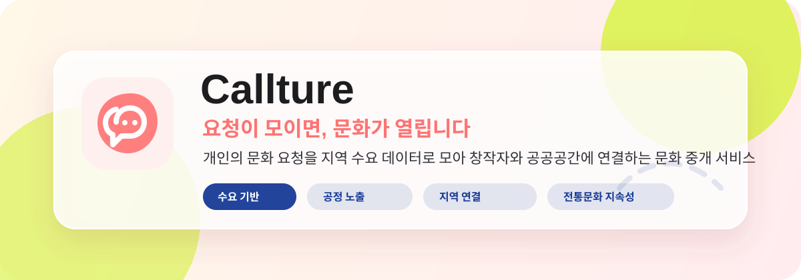

# 문화콜 Culture Call

<p align="center">
  
</p>

<p align="center">
  <b>문화가 필요한 곳에서 시작되는 작은 문화 프로그램</b><br/>
  사용자의 문화 요청을 모아 지역 창작자와 공공공간을 연결합니다.
</p>

---

## 1. 프로젝트 소개

문화콜은 사용자가 직접 원하는 문화 경험을 요청하고, 비슷한 요청이 일정 수준 이상 모이면 지역 창작자와 공공공간이 연결되어 작은 문화 프로그램으로 이어지는 플랫폼입니다.

기존 문화행사 추천 서비스는 이미 만들어진 공연, 전시, 축제 정보를 사용자가 검색하거나 추천받는 구조에 가깝습니다. 하지만 현실에서는 문화 프로그램이 존재하더라도 지역, 이동 거리, 비용, 시간, 연령, 정보 접근성의 차이로 인해 실제로 문화를 경험할 수 있는 기회가 불균형하게 분배됩니다.

문화콜은 이러한 문제를 해결하기 위해 사용자의 문화 수요를 직접 수집하고, 비슷한 요청을 군집화하여 하나의 문화콜로 묶습니다. 이후 해당 문화콜을 지역 창작자, 소규모 예술가, 전통문화 활동가, 공공공간과 연결하여 실제 프로그램 생성 가능성을 높입니다.

즉, 문화콜은 문화를 더 많이 보여주는 서비스가 아니라, 문화가 필요한 사람에게 도달하고 다양한 문화가 공정하게 발견되며 지역 문화가 지속적으로 생성되는 구조를 목표로 합니다.

---

## 2. 문제 정의

### 문화 접근의 불균형

문화시설, 공연, 전시, 체험 프로그램은 존재하지만 모든 사용자가 실제로 접근할 수 있는 것은 아닙니다.

- 이동 거리가 멀어 참여하기 어려운 경우
- 비용 부담으로 문화생활을 포기하는 경우
- 지역 내 문화 정보가 흩어져 있어 찾기 어려운 경우
- 청소년, 고령층, 문화 초심자가 참여 가능한 프로그램을 발견하기 어려운 경우

문화콜은 사용자가 내가 원하는 문화를 직접 요청하게 함으로써 공급자 중심의 문화 제공 구조를 수요자 중심으로 전환합니다.

### 문화 산업의 구조적 양극화

대형 공연, 유명 전시, 인기 콘텐츠는 반복적으로 노출되지만 지역 창작자, 신진 예술가, 전통문화 활동가, 소규모 문화 프로그램은 충분히 발견되지 못합니다.

문화콜은 인기순, 조회수순 추천이 아니라 사용자의 실제 요청과 지역 기반 수요를 중심으로 문화 프로그램이 생성되도록 설계합니다.

### 전통문화의 지속가능성 문제

전통문화는 보존의 대상으로만 남아 있는 경우가 많습니다. 문화콜은 전통문화를 단순 전시나 일회성 체험이 아니라 현대 사용자의 요청과 지역 프로그램으로 연결하여 일상 속에서 다시 선택될 수 있는 문화 자원으로 바라봅니다.

---

## 3. 핵심 아이디어

문화콜의 핵심 흐름은 다음과 같습니다.

1. 사용자가 원하는 문화 경험을 요청합니다.
2. 서버는 요청 내용을 저장하고 지역, 관심사, 비용, 시간대 등의 정보를 함께 관리합니다.
3. AI 또는 유사도 기반 로직을 통해 비슷한 요청을 하나의 군집으로 묶습니다.
4. 일정 수 이상의 요청이 모이면 하나의 문화 수요로 판단합니다.
5. 지역 창작자, 소규모 예술가, 전통문화 활동가, 공공공간이 해당 요청에 응답할 수 있습니다.
6. 최종적으로 작은 문화 프로그램이 생성되고 사용자에게 다시 연결됩니다.

---

## 4. 주요 기능

### 사용자 기능

- 문화 요청 작성
- 관심 분야 선택
- 지역 선택
- 희망 시간대 선택
- 예산 범위 입력
- 비슷한 요청 확인
- 요청이 모인 문화콜 확인
- 생성 예정 문화 프로그램 확인

### 문화 요청 군집화 기능

- 요청 제목 및 내용을 기반으로 유사 요청 분류
- 지역, 카테고리, 시간대, 예산 조건을 함께 고려
- 비슷한 요청이 일정 개수 이상 모이면 문화콜로 전환

### 창작자 및 공간 매칭 기능

- 지역 창작자 또는 문화 기획자가 문화콜 확인
- 공공공간 또는 문화공간과 연결 가능
- 생성 가능한 프로그램 제안

### 관리자 기능

- 요청 목록 관리
- 문화콜 군집 확인
- 프로그램 생성 여부 관리
- 창작자 및 공간 데이터 관리

---

## 5. 서비스 흐름

```text
[사용자]
문화 요청 작성
    ↓
[서버]
요청 데이터 저장
    ↓
[AI/로직]
비슷한 요청 군집화
    ↓
[문화콜 생성]
일정 수 이상의 요청이 모이면 문화 수요로 판단
    ↓
[창작자/공간]
지역 창작자와 공공공간 매칭
    ↓
[프로그램 생성]
작은 공연, 전시, 체험, 전통문화 프로그램으로 연결
```

---

## 6. 기술 스택

### Frontend

- React
- JavaScript
- HTML/CSS

### Backend

- Django
- Django REST Framework
- SQLite

### AI / Logic

- Python
- 요청 텍스트 유사도 계산
- 카테고리 기반 군집화
- 지역 및 조건 기반 필터링

### Collaboration

- GitHub
- Branch 기반 협업
- Pull Request 기반 Merge

---

## 7. 예상 데이터 구조

### Request

사용자의 문화 요청 정보를 저장합니다.

| 필드명 | 설명 |
| --- | --- |
| id | 요청 ID |
| title | 요청 제목 |
| content | 요청 상세 내용 |
| category | 문화 분야 |
| region | 희망 지역 |
| budget | 희망 예산 |
| preferred_time | 희망 시간대 |
| age_group | 사용자 연령대 |
| created_at | 요청 생성 시간 |

### CultureCall

비슷한 요청이 모여 생성된 문화콜 정보를 저장합니다.

| 필드명 | 설명 |
| --- | --- |
| id | 문화콜 ID |
| title | 문화콜 제목 |
| category | 문화 분야 |
| region | 대상 지역 |
| request_count | 모인 요청 수 |
| status | 진행 상태 |
| created_at | 생성 시간 |

### Creator

지역 창작자 또는 문화 기획자 정보를 저장합니다.

| 필드명 | 설명 |
| --- | --- |
| id | 창작자 ID |
| name | 이름 |
| category | 활동 분야 |
| region | 활동 지역 |
| description | 소개 |

### Space

공공공간 또는 문화공간 정보를 저장합니다.

| 필드명 | 설명 |
| --- | --- |
| id | 공간 ID |
| name | 공간명 |
| region | 위치 |
| capacity | 수용 인원 |
| description | 공간 설명 |

---

## 8. 프로젝트 차별점

### 기존 문화행사 추천 서비스와의 차이

기존 서비스는 이미 만들어진 공연, 전시, 축제를 사용자가 검색하거나 추천받는 구조입니다. 문화콜은 사용자가 직접 문화 수요를 만들고, 그 수요가 모이면 새로운 문화 프로그램으로 이어지는 구조입니다.

### 인기순 추천 구조와의 차이

문화콜은 조회수, 좋아요, 인기순 중심의 추천을 지양합니다. 대신 지역성, 접근 가능성, 소규모 창작자 연결 가능성, 사용자 요청의 밀도를 중심으로 문화 프로그램을 생성합니다.

### 단순 지도 기반 서비스와의 차이

문화콜은 단순히 문화공간을 지도에 보여주는 것이 아니라, 사용자가 실제로 원하는 문화 경험이 지역 내에서 만들어질 수 있도록 요청, 군집화, 매칭, 프로그램 생성을 연결합니다.

### 전통문화 활용 방식의 차이

문화콜은 전통문화를 박물관식 설명이나 단순 체험으로만 다루지 않습니다. 사용자의 요청과 지역 창작자를 연결하여 전통문화가 현대적인 프로그램, 굿즈, 체험, 커뮤니티 활동으로 재생산될 수 있도록 합니다.

---

## 9. 기대 효과

### 사용자 측면

- 가까운 지역에서 참여 가능한 문화 경험 발견
- 비용, 시간, 거리 조건에 맞는 문화 수요 표현 가능
- 문화 초심자도 쉽게 원하는 경험을 요청 가능

### 창작자 측면

- 소규모 창작자와 지역 예술가의 노출 기회 확대
- 실제 수요가 있는 프로그램을 기획할 수 있음
- 대형 플랫폼에 의존하지 않고 지역 기반 관객과 연결 가능

### 지역사회 측면

- 공공공간의 활용도 증가
- 지역 문화 생태계 활성화
- 전통문화와 지역 콘텐츠의 지속적인 재생산 가능

---

## 10. MVP 구현 범위

해커톤 기간 동안 구현할 핵심 기능은 다음과 같습니다.

### 필수 구현

- 문화 요청 작성 페이지
- 요청 목록 조회 페이지
- 요청 상세 페이지
- 유사 요청 군집화 로직
- 문화콜 목록 페이지
- 문화콜 상세 페이지
- Django REST API
- 기본 DB 모델 구성

### 선택 구현

- 지도 API 연동
- 창작자/공간 매칭 화면
- 관리자 페이지
- 추천 점수 시각화
- 문화콜 진행 상태 표시

---

## 11. 폴더 구조

```text
khuthon-2026/
│
├── assets/
│   └── culturecall-banner.svg
│
├── backend/
│   ├── manage.py
│   ├── config/
│   └── culturecall/
│       ├── models.py
│       ├── serializers.py
│       ├── views.py
│       ├── urls.py
│       └── admin.py
│
├── frontend/
│   ├── src/
│   ├── public/
│   └── package.json
│
├── README.md
└── .gitignore
```

---

## 12. 실행 방법

### Backend 실행

```bash
cd backend
python -m venv venv
```

Windows 환경에서는 다음 명령어를 사용할 수 있습니다.

```bash
venv\Scripts\activate
```

macOS 또는 Linux 환경에서는 다음 명령어를 사용할 수 있습니다.

```bash
source venv/bin/activate
```

패키지 설치 후 서버를 실행합니다.

```bash
pip install -r requirements.txt
python manage.py migrate
python manage.py runserver
```

### Frontend 실행

```bash
cd frontend
npm install
npm start
```

---

## 13. Git 협업 규칙

본 프로젝트는 main 브랜치에 직접 push하지 않고, 기능별 브랜치를 생성한 뒤 Pull Request를 통해 병합합니다.

### Branch 예시

```text
feat/backend-api
feat/frontend-ui
feat/ai-clustering
fix/request-form
docs/readme
```

### Commit Message 예시

```text
feat: 문화 요청 모델 추가
feat: 요청 작성 API 구현
fix: 요청 목록 조회 오류 수정
docs: README 프로젝트 설명 추가
style: 요청 카드 UI 수정
```

### 기본 작업 흐름

```bash
git checkout main
git pull origin main
git checkout -b feat/기능명

# 작업 후
git add .
git commit -m "feat: 작업 내용"
git push origin feat/기능명
```

이후 GitHub에서 Pull Request를 생성하고 팀원 확인 후 main 브랜치에 병합합니다.

---

## 14. 팀 역할

| 역할 | 담당 내용 |
| --- | --- |
| Backend | Django 서버, DB 모델, API 구현 |
| Frontend | React 화면 구성, 사용자 입력 폼, 결과 페이지 구현 |
| AI/Logic | 요청 유사도 계산, 군집화 로직 구현 |
| PM/Docs | 발표 자료, README, 데이터 조사, GitHub 관리 보조 |

---

## 15. 발표 시나리오

문화콜은 다음과 같은 사용자 시나리오를 중심으로 시연합니다.

```text
1. 사용자가 우리 동네에서 전통 공예 체험을 하고 싶다는 요청을 작성한다.
2. 다른 사용자들도 비슷한 요청을 작성한다.
3. 서버는 비슷한 요청을 하나의 문화콜로 묶는다.
4. 일정 수 이상의 요청이 모이면 문화콜이 활성화된다.
5. 지역 창작자 또는 공공공간이 해당 문화콜에 응답한다.
6. 최종적으로 작은 지역 문화 프로그램이 만들어진다.
```

이 흐름을 통해 문화콜이 단순한 문화행사 검색 서비스가 아니라, 지역의 문화 수요를 발견하고 실제 프로그램 생성으로 연결하는 플랫폼임을 보여줍니다.

---

## 16. 프로젝트 목표

문화콜은 문화 접근성, 문화 다양성, 지역문화 활성화, 전통문화 지속가능성 문제를 소프트웨어적으로 해결하기 위한 해커톤 프로젝트입니다.

최종 목표는 사용자가 문화를 수동적으로 소비하는 것이 아니라, 직접 요청하고 함께 만들며 지역 창작자와 연결되는 문화 생태계 순환 구조를 제안하는 것입니다.
